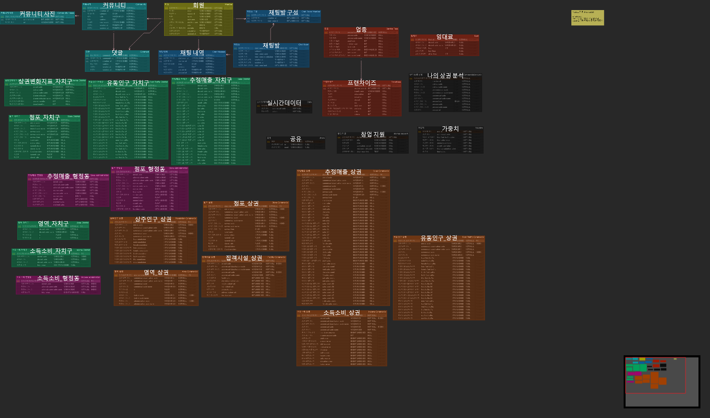

# NowDoBoss (삼성 청년 SW 아카데미 10기 2학기 자율 프로젝트)

## ✨ 프로젝트 개요

### 1. 프로젝트명

나도사장 (NowDoBoss)

### 2. 프로젝트 기간

2024.04.08 ~ 2024.05.20(6주)

### 3. 프로젝트 주제

창업을 위한 상권 분석 서비스 플랫폼

### 4. 서비스 타겟층

창업을 준비하고 있으며 자기 지역 상권을 분석하고 싶은 예비 창업자들, 현재 가게를 운영하고 있으며 동업종 및 상권을 분석하고 싶은 창업자들

### 5. 프로젝트 주요 기능

#### 👦 회원 (회원 관련 좀 더 상세하게 적을거임!!!)

- 일반 회원가입
  - 이메일 인증코드를 통한 인증코드 확인 및 이메일 중복 확인 
  - Validation을 이용하여 입력값들에 대한 유효성 검사 기능
- 로그인 / 로그아웃
  - Spring Security + JWT를 통한 토큰을 통한 세션 관리 기능
  - 액세스 토큰 만료시 리프레쉬 토큰을 이용한 토큰 재발급 기능
- 회원정보 변경
  - 닉네임 수정 및 Firebase Storage를 이용한 프로필 이미지 변경 기능
  - 일반 회원인 경우 비밀번호 변경 기능
- 소셜 로그인
  - 네이버, 카카오, 구글을 통한 사용자의 쉬운 소셜 로그인 제공
- 회원 탈퇴
  - 일반 회원가입 한 유저, 소셜 로그인을 통한 유저 회원 탈퇴 기능 제공

#### 📰 구별 현황

- 서울시 자지구 현황 화면
  - 유동인구, 평균 매출, 개업률, 폐업률 4가지 범주에 대해 자치구 Top 10 순위 제공
  - 서울시 지도를 통해 시각적으로 서울시 전체 자치구들의 유동인구, 평균 매출, 개업률, 폐업률 정보 제공
  - 순위 또는 지도를 누르면 해당 자치구의 상세 현황으로 이동

- 자치구 현황 상세 화면
  - 유동인구
    - 분기별 평균 유동인구
    - 시간대별 유동인구 
    - 성별 유동인구 
    - 연령대별 유동인구 
    - 요일별 유동인구 정보 제공
  -  점포
    - 업종 별 점포 수 순위 제공
  - 개업률
    - 해당 자치구에 포함된 행정동 별 개업률 Top 5 제공
  - 평균 운영 영업 개월
    - 해당 자치구 평균과 서울시 평균 비교
  - 폐업률 
    - 해당 자치구에 포함된 행정동별 폐업률 Top 5 제공
  - 평균 폐업 영업 개월
    - 해당 자치구 평균과 서울시 평균 비교
  - 매출 분석
    - 해당 자치구에 포함된 행정동 별 매출 Top 5 제공
    - 업종 별 매출 Top 5 제공
  - 상권 변화 지표
    - 해당 자치구의 상권 변화 지표 제공
  - 한줄 요약
    - 위의 자치구 상세 현황을 한 눈에 파악할 수 있도록 요약한 정보 제공

#### 💬 상권 분석

- 상권 & 업종 분석 한눈에 보기
  - 유동인구 요약 정보
    - 가장 많은 성별: 해당 상권의 유동인구 중 가장 많은 성별 정보를 제공
    - 가장 많은 연령대: 해당 상권의 유동인구 중 가장 많은 연령대 정보를 제공
    - 가장 많은 시간대: 해당 상권의 유동인구 중 가장 많은 시간대 정보를 제공
  - 매출 요약 정보
    - 총 매출: 해당 상권의 총 매출 금액을 제공
    - 월 평균 매출: 월별 평균 매출 금액을 제공
    - 1회 평균 결제 금액 (추정 매출): 1회 평균 결제 금액을 추정하여 제공
  - 창업 TIP
    - 해당 상권에서의 창업할 때 상권의 주요 고객층과 마케팅 전략에 대한 조언을 포함한 유용한 팁을 제공

- 상권 분석 디테일
  - 사이드바 카테고리
    - 상권 분석의 다양한 카테고리로 쉽게 이동할 수 있는 사이드바 메뉴를 제공
      - 유동인구 분석
      - 집객시설 분석
      - 점포 분석
      - 매출 분석
      - 상주인구 분석
      - 지출 분석
  - 분석 데이터 분기별 선택
    - 년도와 분기를 선택하여 해당 기간의 상권 분석 데이터를 확인
    - 시간에 따른 상권 변화 데이터를 그래프를 통해 제공하여 상권 변화를 추적하고 분석 가능
  - 유동인구 분석
    - 일일 평균 유동인구 수와 주중/주말 유동인구 비교
    - 시간대별, 연령대별, 성별 유동인구 비율 제공
    - 요일별 유동인구 변동 패턴 제공
  - 집객시설 분석 (이부분 추가 예정)
    - 해당 상권의 주요 집객시설 정보 제공
    - 교육시설, 교통수단 등의 집객시설 분석
  - 점포 분석
    - 상권 내 점포 수와 업종별 점포 분석
    - 프렌차이즈 점포 비율과 개업률, 폐업률 정보 제공
  - 매출 분석
    - 추정 매출액과 행정동 전체 매출액 대비 비율: 선택한 상권의 추정 매출액이 해당 행정동 전체 매출액에서 차지하는 비율을 제공
    - 자치구 내 비율: 해당 상권의 매출액이 자치구 전체 매출액에서 차지하는 비율을 제공
    - 주중/주말 매출 패턴 비교: 주중과 주말의 매출액과 매출건수 비교한 데이터를 막대 그래프로 제공
    - 요일별 매출액 패턴 비교: 요일별로 매출액과 매출 건수를 비교한 데이터를 막대 그래프로 제공
    - 연령별, 성별, 매출액 분석: 연령대별 및 성별로 매출액을 분석하여 제공
  - 상주인구 분석
    - 상주인구의 성별, 연령대별 비율
    - 상주인구 비율이 높은 연령대와 특징 정보 제공
  - 지출 분석
    - 총 지출금액: 해당 자치구와 행정동의 지출 분석 대비 비율 제공 및 해당 자치구, 행정동, 상권의 지출금액을 수직 막대 그래프로 제공
    - 유형별 지출 금액: 유형별 카테고리 (식료품, 의류, 의료비, 생활용품, 교통, 여가, 문화, 교육, 유흥) 지출 비율을 수평 막대 그래프로 제공

- 리포트 저장 및 공유 기능
  - 분석 리포트 저장
    - 분석한 리포트를 사용자 계정의 나의 북마크 목록 (상권 분석 리스트)에 저장할 수 있는 기능 제공
  - 카카오톡 공유하기
    - 분석한 리포트를 카카오톡을 통해 쉽게 공유할 수 있는 기능 제공
    - 공유된 리포트는 링크를 통해 다른 사용자와 쉽게 공유 가능

#### 창업 시뮬레이션

- 업종별 프랜차이즈 검색 
  - 프랜차이즈 브랜드 이름, 업종 코드 등 프랜차이즈 관련 정보 제공

- 업종별 가게 크기 조회
  - 업종별 가게 소형, 중형, 대형 크기(평, 제곱미터) 정보 제공

- 창업 시뮬레이션
  - 총 투자비용
  - 권리금 정보
    - 권리금 유비율
    - 권리금 수준 평균
    - 권리금 수준 ㎡당 평균
  - 투자비용 상세정보
    - 임대료
    - 보증금
    - 인테리어 비용
    - 가맹 사업자 부담금
  - 프랜차이즈 비교(현재 선택한 업종의 프랜차이즈 중 가장 유사한 투자비용이 필요한 상위 5개 프랜차이즈 정보)
    - 프랜차이즈 투자비용
    - 브랜드 이름
    - 가입비
    - 교육비
    - 가맹 보증금
    - 기타 비용
    - 인테리어 비용
  - 남녀, 연령대별 고객 분석
    - 남성 고객 비율
    - 여성 고객 비율
    - 매출 많은 연령대 1~3순위(연령대, 매출금액)
    - 성수기, 비성수기
  - 창업 시뮬레이션 결과 저장
  - 내 창업 시뮬레이션 결과 목록 조회
  - 창업 시뮬레이션 결과 카카오톡 공유하기

#### 📝 상권 추천

- 추천 상권 영역 선택 + 지도 화면
  - 유저가 지역구와 행정동(고르지 않으면 행정동 전체)를 고르면 해당 영역에 안에 있는 상권들 중 유저에게 맞는 상권 추천
  - 지도 레벨에 따라 자치구, 행정동, 상권 영역을 묶어 지역 선택 가능
  - 영역을 선택하면 해당 영역으로 지도 이동 및 드롭다운에 지역 선택됨
  - 상위 지역을 선택하지 않고 하위 지역 선택 시 (동, 상권 등) 해당하는 자치구와 행정동 자동으로 매핑됨
  - 행정동 선택된 상태에서 자치구 선택 시 행정동 리셋

- 유저 맞춤형 추천 상권 정보 화면
  - 데이터 양에 따라 최대 3개의 상권 추천
  - 추천 상권의 정보를 한눈에 볼 수 있는 요약 정보 제공
  - 해당 상권의 유동인구, 해당 상권이 포함된 행정동의 평균 유동인구, 서울시 평균 유동인구 비교
  - 해당 상권의 점포 수, 해당 상권이 포함된 행정동의 평균 점포 수, 서울시 평균 점포수 비교
  - 해당 상권의 폐업률, 해당 상권이 포함된 행정동의 평균 폐업률, 서울시 평균 폐업률 비교
  - 해당 상권의 총 매출, 해당 상권이 포함된 행정동의 평균 총 매출, 서울시 평균 총 매출 비교
  - 블루오션 업종 추천: 해당 상권에는 적지만 주변에는 많은 업종 Top 5 추천
    - 해당 상권의 특정 업종 점포 수와 해당 상권이 포함된 행정동의 특정 업종 점포 수를 통해 정보 제공
  - 추천 상권 정보 보관함 저장 기능 제공 => 마이페이지에서 해당 추천 상권 조회 기능 제공
  - 해당 상권의 더 자세한 정보가 담긴 상권 분석 페이지로 이동 가능

#### ✔️ 커뮤니티

- 게시글 작성
  - 사용자가 다양한 주제 (이모저모, 인테리어, 상권공유, 동업제안, 창업고민)로 게시글을 작성할 수 있는 기능 제공
  - 게시글 작성 후 '완료' 버튼을 눌러 업로드 할 수 있으며, 업로드 중 로딩을 통한 상태 표시
  - 제목, 내용, 카테고리, 이미지 첨부 가능

- 게시믈 보기
  - 사용자가 작성한 게시글을 확인할 수 있는 기능을 제공, 게시글에는 조회수, 댓글 수, 작성 시간 등이 표시
  - 게시글을 클릭하면 상세 페이지로 이동하여 내용을 확인하고 댓글을 작성할 수 있는 기능 제공

- 인기 게시글
  - 이번주 조회수 기준으로 인기글 TOP 10을 확인할 수 있는 기능 제공
  - 인기 글 목록은 조회수 기준으로 업데이트 되어 최신 인기 게시글을 제공

- 카테고리별 게시글
  - 다양한 카테고리별로 게시글을 분류하여 제공
  - 각 카테고리를 클릭하면 해당 카테고리에 속한 게시글만 모아서 볼 수 있는 기능 제공

- 댓글 기능
  - 사용자가 게시글에 댓글을 작성할 수 있는 기능을 제공
  - 댓글 작성 후 수정 및 삭제 기능 제공

- 비슷한 게시글 추천
  - 사용자가 보고 있는 게시글과 비슷한 카테고리의 게시글을 추천해주는 기능 제공

#### ✔️ 채팅

- 채팅방 생성
  - 사용자가 새로운 채팅방을 생성할 수 있는 기능 제공
  - 채팅방 이름, 소개, 카테고리, 최대 인원을 설정하여 채팅방을 생성 가능

- 채팅방 목록
  - 사용자가 참여하고 있는 채팅방 목록을 확인할 수 있는 기능 제공
  - 채팅방을 검색하여 쉽게 찾을 수 있는 기능 제공

- 인기 채팅방
  - 현재 인기 있는 채팅방 TOP 10을 확인할 수 있는 기능 제공
  - 인기 채팅방 목록은 인원수 기준으로 업데이트 되어 최신 인기 채팅방을 제공

- 채팅 메시지 전송
  - 실시간으로 채팅 메시지를 주고받을 수 있는 기능 제공
  - 새로운 메시지가 도착하면 FCM 알림을 통해 사용자에게 알려주는 기능 제공

- 채팅방 나가기
  - 모든 인원이 채팅방을 나갈 경우 채팅방 삭제 

#### 실시간 인기 자치구, 행정동, 상권 순위

- 도메인 대기능 소개
  - 해당 도메인에 따른 소기능 소개
  - 해당 도메인에 따른 소기능 소개
  - 해당 도메인에 따른 소기능 소개

- 도메인 대기능 소개
  - 해당 도메인에 따른 소기능 소개
  - 해당 도메인에 따른 소기능 소개
  - 해당 도메인에 따른 소기능 소개

## ✏️ 기술 특이점

### ALS 알고리즘 기반 협업 필터링

- 실시간 데이터 추천: Hadoop HDFS에 저장된 대량의 상권 데이터들과 Kafka를 통한 실시간 데이터를 기반으로 상권 추천
- 효율적인 데이터 처리: Spark를 활용하여 데이터를 빠르고 효율적으로 처리하며, 사용자별 맞춤형 가중치를 적용하여 개개인의 특성에 맞는 상권을 추천
- 데이터 수가 적은 초기에는 아이템 기반 협업 필터링을 활용해 상권 추천 + 이후 데이터 양이 충분해지면 사용자 기반 협업 필터링으로 전환
- 실시간 학습 모델 업데이트: 추천 결과를 기반으로 가중치를 점진적으로 업데이트하여 학습 모델을 실시간으로 반영

### 대량의 상권 데이터 병렬 처리

- 분산 저장 및 처리: Hadoop을 이용하여 대량의 상권 데이터를 분산 저장 및 처리하며, Spark를 활용하여 데이터 분석 및 머신러닝 모델을 적용
- 분산 클러스터 적용: Hadoop과 Spark의 분산 클러스터를 적용하여 대규모 데이터의 병렬 처리를 강화, 이를 통한 데이터 처리 속도 및 분석 정확도 극대화
- FastAPI와의 연동: FastAPI 서버와 PySpark를 연동하여 데이터 처리와 분석 결과를 빠르고 효율적으로 제공

### Kafka 분산 클러스터 적용 및 실시간 사용자 행동 분석

- 분산 클러스터 구축: 3대의 Kafka 분산 클러스터를 적용하여 높은 가용성과 안정성을 보장, 이를 통해 대규모 데이터 스트림을 실시간으로 처리하고 분석 가능
- 실시간 행동 분석: Kafka의 KStreams를 이용하여 사용자의 실시간 행동을 분석하며, 이를 인기 검색어에 반영

### 캐싱을 통한 성능 개선

- Redis 캐싱: Redis를 이용한 캐싱 처리를 통해 데이터 접근 속도를 대폭 향상시키며, cache warming을 통해 초기 조회 성능을 개선
- Client 캐싱: ReactQuery를 이용한 Client 측 캐싱 처리를 통해 사용자가 보다 빠르게 데이터를 조회 할 수 있도록 함

### 실시간 인기 자치구, 행정동, 상권 순위 기능

- 실시간 인기 데이터 추출: Kafka의 Kstreams를 이용하여 Kafka Store에 저장된 사용자의 실시간 행동 분석 데이터(하루치)를 WordCount를 적용하여 인기 데이터를 추출
- 정기적인 데이터 갱신: Spring Scheduler를 이용하여 10분마다 실시간 인기 자치구, 행정동, 상권 순위 데이터를 갱신, 갱신된 데이터는 SSE(Server-Sent Evenets) 통신을 통해 사용자에게 실시간으로 제공

### WebSocket, STOMP, Kafka를 활용한 실시간 채팅 기능

- 실시간 채팅 지원: WebSocket과 STOMP 프로토콜을 활용하여 실시간 채팅 기능을 구현
- Kafka 연동: Kafka를 통해 채팅 메시지를 분산 처리 하여 높은 확장성과 안정성 보장

### Spirng security + JWT 기술

- 강화된 보안: Spring Security와 JWT를 활용하여 로그인한 사용자의 인증 및 요청 검증을 수행, 모든 인바운드 요청에 대해 JWT의 유효성을 검사하여 보안을 강화
- 유효성 검증: Spring JwtAuthenticationFilter를 통해 유효한 JWT를 검사하고, 유효한 경우 사용자의 인증 정보를 SecurityContext에 저장
- API 접근 권한 관리: 사용자의 인증 정보를 기반으로 API 접근 권한을 부여하여 보안성을 높임

### Spring WebFlux

- 반응형 프로그래밍: Spring WebFlux의 WebClient, Mono, Flux를 사용하여 반응형으로 프로그래밍, 비동기적이고 비차단적인(non-blocking) I/O를 사용하여 높은 동시성을 지원
- 높은 응답성: 비차단 I/O를 통해 더 적은 리소스로 더 많은 요청을 동시에 처리하며, 로드가 심한 경우에도 애플리케이션의 응답성을 유지

### Zustand 상태관리

- 상태관리 최적화: Zustand를 사용하여 클라이언트 측 상태 관리를 최적화 
- 비동기 데이터 처리: ReactQuery와 결합하여 비동기 데이터 처리를 효과적으로 관리하며, 사용자 경험을 개선

### PWA를 통한 모바일 지원

- 
- 

## ✨ 서비스 화면

### 인트로화면

- 사이트 기능 소개
- 반응형 및 다크모드 지원 (전체 페이지에서 동일하게 지원)

### 메인화면

- 메인화면
  - 주요 기능에 대한 간단한 소개
  

  
  

- 모바일
  

  
  

### 인기 검색어 화면
- 웹
  - 대기능의 따른 소기능 소개
  - 대기능의 따른 소기능 소개
  - 대기능의 따른 소기능 소개
  - 대기능의 따른 소기능 소개
  

  
  

### 구별 현황 화면

- 서울시 자치구 현황 화면
  - 유동인구, 평균 매출, 개업률, 폐업률 4가지 범주에 대해 자치구 Top 10 순위 제공
  

  
  

- 서울시 자치구 현황 상세 화면
  - 서울시 지도를 통해 시각적으로 서울시 전체 자치구들의 유동인구, 평균 매출, 개업률, 폐업률 정보 제공
  - 순위 또는 지도를 누르면 해당 자치구의 상세 현황으로 이동
  

  
  

- 모바일 화면
  

  
  

### 상권 분석 화면

- 분석 상권 영역 선택 + 상권 분석 상세
  - 서울시 자치구, 행정동, 상권, 업종 선택 시 해당 상권 분석 제공
  - 지도를 통해 영역 선택 가능
  - 요약, 유동인구, 집객시설, 점포, 매출, 상주인구, 지출 분석
  - 년도, 분기 별 데이터 제공
  - 리포트 저장 기능 제공
  

  
  

- 모바일
  

  
  

### 창업 시뮬레이션 화면

- 창업 시뮬레이션
  - 지역, 업종, 상세업종, 프랜차이즈 여부, 프랜차이즈 이름, 매장 크기, 층수를 선택
  - 프랜차이즈 조회 시 해당 업종의 프랜차이즈 이름 조회가능
  - 입력값을 바탕으로 창업 비용을 계산
  - 총 비용, 상세 비용, 프랜차이즈 비교, 성수기/비성수기, 연령/성별 분석 정보 제공
  

  
  

- 창업 시뮬레이션 저장
  - 창업 시뮬레이션 결과 저장
  - 로그인한 사용자마다 저장한 결과를 다시 조회할 수 있다.
  

  
  

- 창업 시뮬레이션 비교
  - 저장된 상업 시뮬레이션 결과들을 이용하여 서로 비교할 수 있다. 
  

  
  

- 창업 시뮬레이션 공유
  - 창업 시뮬레이션 결과를 다른 사람과 카톡을 통해 공유 가능
  - 로그인하지 않은 사용자들도 조회는 가능하지만 저장은 로그인해야 가능
  

  
  

- 모바일 화면
  

  
  
  
  

### 상권 추천 화면
- 추천 상권 영역 선택 + 지도 화면
  - 유저가 지역구와 행정동(고르지 않으면 행정동 전체)를 고르면 해당 영역 내 상권 추천
  - 지도를 통한 선택도 가능
  

  
  
  

- 유저 맞춤형 추천 상권 정보 화면
  - 최대 3개의 상권 추천
  - 추천 상권의 정보를 한눈에 볼 수 있는 요약 정보 제공
  - 유동인구, 점포 수, 폐업률, 매출, 블루오션 업종 관련 정보 제공
  - 보관함 저장 기능 제공
  

  
  

- 모바일 화면
  

  
  
  

### 커뮤니티 화면

- 커뮤니티 
  - 커뮤니티 글 작성
  

  
  

  - 커뮤니티 글 수정
  

  
  

  - 커뮤니티 글 삭제
  

  
  

- 커뮤니티 댓글
  - 커뮤니티 댓글 작성
  

  
  

  - 커뮤니티 댓글 수정
  

  
  

  - 커뮤니티 댓글 삭제
  

  
  

- 모바일 화면
  

  
  
  
  

  

  
  

### 채팅 화면

- 채팅방 생성
  - 채팅방 이름, 소개, 제한인원, 카테고리 설정 가능
  - 제한인원만큼만 채팅방 입장 가능
  

  
  

- 채팅방 나가기
  - 해당 채팅방 나가기
  - 모든 채팅방 구성원이 방을 나갈 경우 채팅방 삭제 
  

  
  

- 채팅
  - 채팅 메시지 주고받기 
  

  
  

  - 채팅 메시지 받았을 경우 알림
  

  
  

- 내 채팅방 검색
  - 내가 입장하고 나가지 않은 채팅방 목록 중 검색
  

  
  

- 모바일 화면
  

  
  
  
  

  

  
  
  
  

### 프로필 화면

- 프로필
  - 회원정보 수정(닉네임, 비밀번호)
  

  
  

  
  - 로그아웃, 회원탈퇴
  

  
  

- 모바일 화면
  

  
  
  

### 일반 회원 관련 화면

- 화면에서 대기능 소개
  - 대기능의 따른 소기능 소개
  - 대기능의 따른 소기능 소개
  - 대기능의 따른 소기능 소개
  - 대기능의 따른 소기능 소개

- 화면에서 대기능 소개
  - 대기능의 따른 소기능 소개
  - 대기능의 따른 소기능 소개
  - 대기능의 따른 소기능 소개
  - 대기능의 따른 소기능 소개

### 소셜 회원 관련 화면

- 일반 로그인 기능
  - 대기능의 따른 소기능 소개
  - 대기능의 따른 소기능 소개
  - 대기능의 따른 소기능 소개
  - 대기능의 따른 소기능 소개

- 소셜 로그인 기능 (구글, 네이버, 카카오)
  - 대기능의 따른 소기능 소개
  - 대기능의 따른 소기능 소개
  - 대기능의 따른 소기능 소개
  - 대기능의 따른 소기능 소개

## 🚀 기술 스택

### Front-End

- React
- Typescript
- axios
- zustand
- React Query
- MUI
- Styled Components
- React-router-dom
- ChartJs
- D3Js
- StompJs
- SockJs
- FCM
- ReactSpring
- SonarQube Scanner
- ESLint Config Airbnb
- Prettier

### Back-End

- JAVA `17.0.9 LTS`
- Spring Boot `3.2.4`
- Lombok
- openAPI `(Swagger 3.0)`
- OAUTH `2.0`
- Gradle `8.7`
- Spring Security
- JWT
- Spring Data JPA
- QueryDSL
- WebFlux
- WebSocket
- STOMP
- Kafka
- KStreams (Kafka Streams)
- Firebase Storage
- FCM
- Jasypt
- Java Mail Sender
- Flyway
- Geotools
- Python `3.8.10`
- FastAPI `0.110.1`

### DB

- MySQL `8.0.36`
- Redis `7.2.4`
- MongoDB `5.0.26`

### Infra

- AWS EC2
- AWS Lightsail
- Ubuntu `20.04.6 LTS`
- Nginx `1.25.5`
- Docker `26.1.0`
- Docker Compose `2.26.1`
- Jenkins `2.458`

### Data

- selenium `4.19.0`
- Hadoop `3.2.4`
- Spark `3.2.1`

## FIGMA
[Figma](https://www.figma.com/file/h2xVJLS6K2pizJeXIhmKuv/%ED%99%94%EB%A9%B4%EC%84%A4%EA%B3%84?type=design&node-id=6-3&mode=design&t=Kvgt9rsyOTJz0HfG-0)

## 프로젝트 노션 페이지

[프로젝트 노션 페이지](https://translucent-polish-c76.notion.site/NowDoBoss-0e1547ea134446c8a5381b4d9b1007d5?pvs=4)

## 기능 명세

[기능명세](https://translucent-polish-c76.notion.site/80c2edffc4e94ebfbfce53b5fd788189?pvs=4)

## API 명세

[API 명세](https://translucent-polish-c76.notion.site/API-f9d618d742e147c598c4a1be013fddd3?pvs=4)

## 프로젝트 관련 기술 정리

[프로젝트 관련 기술 정리](https://translucent-polish-c76.notion.site/bfb4a85a5c4d4df2865e481621ef7df4?v=4f46ef6e18cd4645b63760a5b09d0170&pvs=4)

## ERD

## System Architecture

## 역할 분담

|   이름   | 역할                | 업무                                                                                             |
| -------- | ------------------ |------------------------------------------------------------------------------------------------|
|  최성호  | 팀장, FE            | 추천 도메인, 지도 도메인, 커뮤니티 도메인, 채팅 도메인,  FCM 알림, 실시간 인기 검색어 도메인, 반응형 웹 제작                            |
|  김온유  | FE                  | 자치구 도메인, 시뮬레이션 도메인, 시뮬레이션 비교 구현, 카카오톡 공유 기능, 반응형 웹 제작                                          |
|  이승현  | FE                  | 상권 도메인, 회원 도메인, 데이터 시각화, 반응형 웹 제작, 클라이언트 측 프로젝트 세팅                                                     |
|  김광연  | BE, Data            | 자치구 도메인, 행정동 도메인, 지도 도메인, 추천 도메인, 협업 기반 필터링 ALS 알고리즘 적용, 실시간 데이터를 활용한 모델 훈련 적용                 |
|  박정인  | BE, Data            | 시뮬레이션 도메인, 커뮤니티 도메인, 채팅 도메인, 카카오톡 공유하기 기능, 창업 지원 도메인, Cache Warming 적용, 프렌차이즈 데이터 크롤링          |
|  신동근  | BE, CI/CD, Data     | 회원 도메인, 상권 도메인, 실시간 인기 검색어 도메인, Kafka 분산 클러스터 적용, Hadoop, Spark 분산 클러스터 적용, DB 마이그레이션, 프로퍼티 암호화 적용 |
